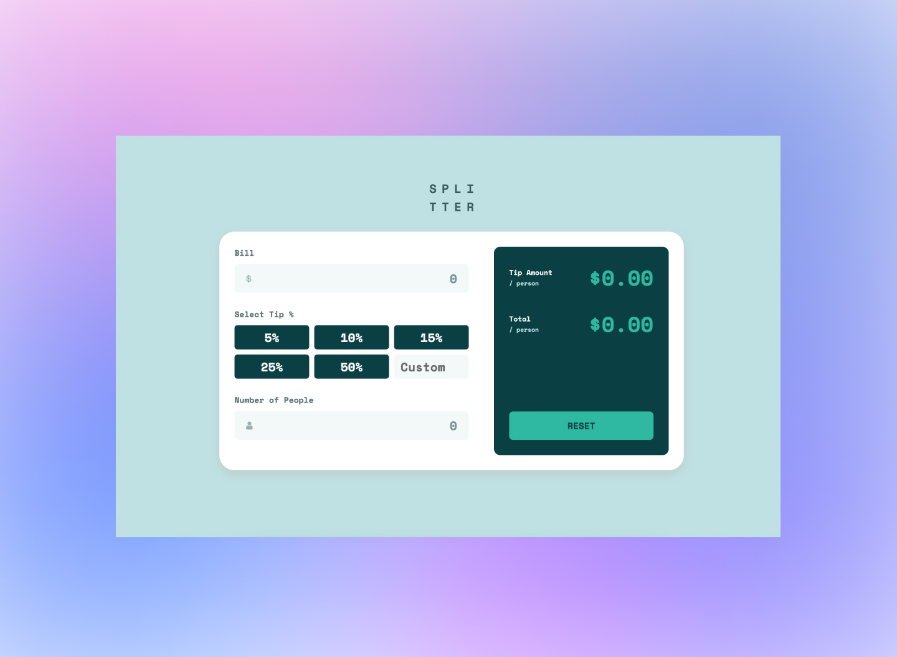

# Tip calculator app

This is my solution to the [Tip calculator app challenge on Frontend Mentor](https://www.frontendmentor.io/challenges/tip-calculator-app-ugJNGbJUX).

## Table of contents

- [Overview](#overview)
  - [The challenge](#the-challenge)
  - [Screenshot](#screenshot)
  - [Links](#links)
- [My process](#my-process)
  - [Built with](#built-with)
  - [What I learned](#what-i-learned)
- [Author](#author)

## Overview

### The challenge

Users should be able to:

- View the optimal layout for the app depending on their device's screen size
- See hover states for all interactive elements on the page
- Calculate the correct tip and total cost of the bill per person

### Screenshot

### Links

- Solution URL: [Github Repository](https://github.com/outHereSam/tip-calculator-app)
- Live Site URL: [Github pages](https://outheresam.github.io/tip-calculator-app/)

## My process

### Built with

- Semantic HTML5 markup
- CSS custom properties
- Flexbox
- CSS Grid
- Mobile-first workflow

### What I learned

I learnt a lot working on this project and the main thing that stuck with me was knowing how to break a program down into functional components and tackle each solution piece by piece. It really helped to flesh out the main task.

## Author

- Website - [Samuel Larbi Danquah](https://github.com/outHereSam)
- Twitter - [@builtbysam](https://www.twitter.com/builtbysam)

